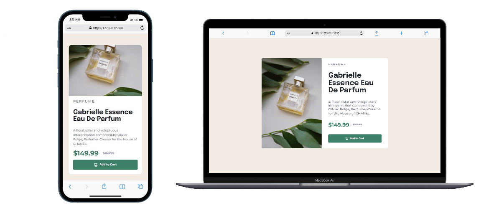

# Frontend Mentor - Product preview card component solution


## Table of contents

- [Overview](#overview)
  - [The challenge](#the-challenge)
  - [Screenshot](#screenshot)
  - [Links](#links)
- [My process](#my-process)
  - [Built with](#built-with)
  - [What I learned](#what-i-learned)
- [Author](#author)

## Overview

### The challenge

Users should be able to:

✅ View the optimal layout depending on their device's screen size

✅ See hover and focus states for interactive elements

### Screenshot



### Links

- Solution URL: [solution URL here](https://www.frontendmentor.io/solutions/product-preview-card-component-vTy_WOgfbs)
- Live Site URL: [live site URL here](https://hyeyoung-lucia.github.io/product-preview-card-component-main/)

## My process

### Built with

- Semantic HTML5 markup
- CSS custom properties
- Flexbox
- Mobile-first workflow

### What I learned

- How to implement responsive layout and active states for interactive elements

  ✨main features below:

  - active states

  ```css
  button,
  .cart-image {
    color: var(--color-white);
  }

  button {
    display: flex;
    justify-content: center;
    align-items: center;
    background-color: var(--color-dark-cyan);
    border-radius: 5px;
    padding: 15px;
    border: none;
  }

  button:hover {
    color: var(--color-dark-cyan);
    background-color: var(--color-white);
    border: solid 1px var(--color-dark-cyan);
    cursor: pointer;
    padding-right: 50px;
  }
  ```

  - responsive

  ```css
  .component {
    margin: auto;
    display: flex;
    flex-direction: column;
    justify-content: center;
    align-items: center;
    max-width: 100%;
    width: 335px;
    background-color: var(--color-white);
    border-radius: 15px;
  }

  .main-image {
    background-image: url("./images/image-product-mobile.jpg");
    background-repeat: no-repeat;
    background-size: contain;
    width: 335px;
    height: 250px;
    border-top-left-radius: 15px;
    border-top-right-radius: 15px;
  }

  .product-description {
    margin-left: auto;
    margin-right: auto;
    max-width: 335px;
    padding: 0 20px 20px 20px;
    text-align: left;
  }

  .price {
    font-family: "Montserrat", sans-serif;
    display: flex;
    align-items: center;
    margin-bottom: 12px;
  }

  /* >=1440 (Desktop) */
  @media screen and (min-width: 1440px) {
    /* product */
    section {
      padding: 25px 20px;
    }

    .component {
      flex-direction: row;
      max-width: 100%;
      width: 700px;
      height: 500px;
      border-radius: 10px;
    }

    .main-image {
      border-top-left-radius: 10px;
      border-top-right-radius: 0px;
      border-bottom-left-radius: 10px;
      width: 335px;
      height: 500px;
      background-image: url("./images/image-product-desktop.jpg");
    }

    .product-description {
      height: 550px;
      padding: 50px 20px;
      text-align: left;
    }

    h1 {
      font-size: var(--font-xl);
    }

    p {
      font-size: 18px;
      margin-bottom: 35px;
    }

    .price {
      margin-bottom: 35px;
    }
  }
  ```

## Author

Hyeyoung Lee

- Frontend Mentor - [@Hyeyoung-Lucia](https://www.frontendmentor.io/profile/Hyeyoung-Lucia)
